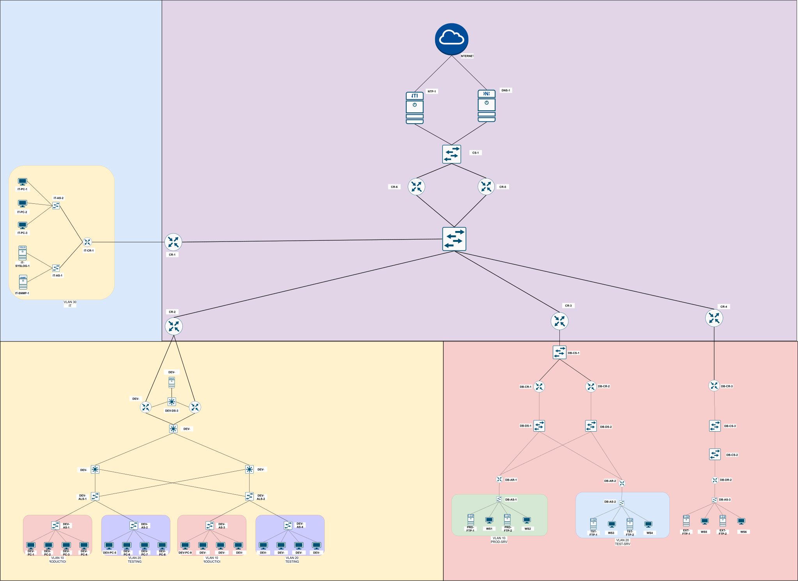

# CCNA Lab 2

>This lab was built as part of my learning process and progress  towards my CCNA journey with the resources learnt from Jeremy IT  Lab CCNA v1 (200-301) Videos Day 1 - Day 47

## Scenario 

**NetFlow Solutions — New York Office**

NetFlow Solutions is a growing tech company that has opened a new office in New York. You are the network engineer responsible for building their office network from the ground up.

The office has two departments which is under the Development Team:

- **Production** — the main engineering team. They need a stable and reliable network at all times.
- **Testing** — the dev and QA team. They need to be isolated from Production so their work doesn't affect it.

Each department has its own file server for internal use. There is also a file server for external clients to access remotely.

All devices get their IP addresses automatically from a central DHCP server. A central DNS server handles name resolution. All device clocks are synced via a central NTP server.

The network is monitored by an IT management team who use a Syslog server and SNMP manager to keep track of everything happening across the network.

The network is built with redundancy in mind — no single device failure should take the whole network down.

---
## LAYOUT 1 (Development Teams)

## LAYOUT 2 (FTP Servers)

## LAYOUT 4 (IT Team)

## LAYOUT 5 (CORE  Network)

## FINAL DIAGRAM 

---
## Implementation 

>[!NOTE]
>#### Phase wise Implementation of the diagram 
>1. [Development Team](parts/Development%20Team.md)